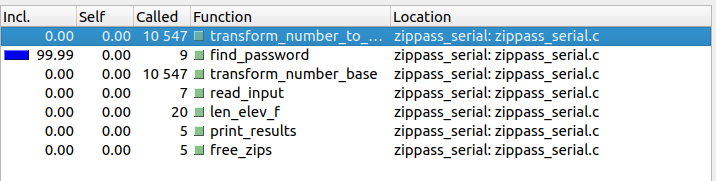

# Results report

The original serial version of the program took a time of 181.075 seconds using case 000.
The results for the different optimizations are presented in the following sections.

## Serial optimization

Based on the information presented by the callgrind tool (see figure 1), the 'transform_number_to_password' and 'transform_number_base' methods are called on the most. Because of this the serial optimization will aim to reduce the amount of times these are called on by generating a password and checking on all the files on each iteration.

## Pthreads optimization (Hw 2)

This optimization was based on making solving the problem using concurrency and static scheduling. The idea is to divide the work between the threads and make them work on different parts of the problem. The static scheduling was used to divide the work evenly between the threads.

## Producer-consumer optimization

This optimization was based on creating a producer-consumer model. The idea is to have a producer thread that generates the passwords and a consumer thread that checks the passwords. The producer thread will generate the passwords and put them on a queue, the consumer thread will take the passwords from the queue and check them. The threads will stop their work when the passwords are found or every password has been generated and checked.
